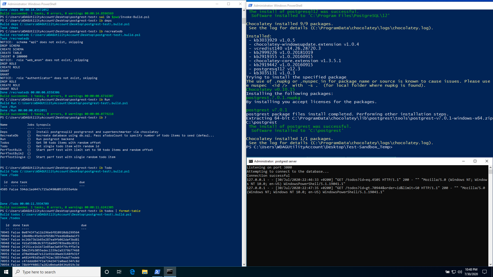

# Postgrest Windows test

This repository contains basic setup and test for [Postgrest](https://github.com/PostgREST/postgrest). All dependencies are automatically installed, database is automatically created so you can start testing and tweaking in minutes.

## Usage

The repository uses embedded [Invoke-Build](https://github.com/nightroman/Invoke-Build). You can call it directly using `./Invoke-Build.ps1`. Its easier to setup alias: `Set-Alias ib $pwd\Invoke-Build.ps1`

To get list of all tasks run `ib ?`:

```
> ib ?

Name           Jobs Synopsis
----           ---- --------
Deps           {}   Install postgresql12 postgrerest and superbenchmarker via chocolatey
RecreateDb     {}   Recreate database using db.sql. Pass aTodosCount to specify number of todo items to seed (default 100K)
Run            {}   Run postgrest backend
Todos          {}   Get 50 todo items with random offset
Todo           {}   Get single todo item with random id
PerfTestBulk   {}   Start perf test with limit set to 50 todo items and random offset
PerfTestSingle {}   Start perf test with single random todo item
```

## Quick start

1. Open administrative shell in repository root and type: `Set-Alias ib $pwd\Invoke-Build.ps1`
2. Install local dependencies only on first run: `ib Deps`<br>
This will install postgresql (with password `test`), postgrest & superbenchmarker via chocolatey.
2. Create database with: `ib RecreateDatabase`.<br>
Modify number of created todo items via `-aTodosCount` argument - by default 100K records are randomly created.
1. Start backend with `ib Run`.
2. Test with `ib Todo` (gets single random todo item) or `ib Todos` (gets bulk todo's)


## Screenshot

The following screenshot is created in Windows Sandbox using the following command:

```ps1
ib RunSandboxed
```

which executes the following script inside VM:

```ps1
cd postgrest-test
Set-Alias ib $pwd\Invoke-Build.ps1
ib Deps, RecreateDb, Run, Todo, Todos
```


